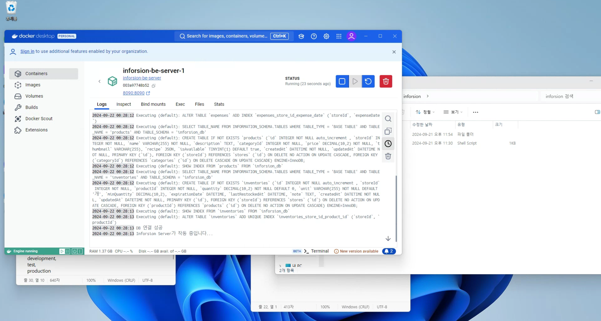

# 지난 10일 나의 목표는?!
- [x] 프로젝트 개발하기
- [x] 멤버십 열심히하기
- [x] 개발 블로그 1편 이상 쓰기

# 잘한 점
- 추석때 진짜 아무생각도 없이 잘 쉰 것 같다. 너무 쉬어서 머리가 아직까지 안돌아간다.. ~~잘 쉰게 아닌가.......?~~

# 공부한 내용
## Docker
부스트캠프와 별개로 nodejs 백엔드 프로젝트를 하나 하고 있는데 이 프로젝트에서 사용하기 위해 Docker를 공부하고 원격으로 웹서버와 DB 서버를 띄우는데에 성공했다. 

이 프로젝트에서는 원격서버를 클라우드 서비스(AWS 같은)를 쓰지 않고, 다른 팀원 분의 집에 있는 미니PC에 서버를 올리기로 결정됐다. 원격으로 docker를 사용해서 현재 내 개발환경과 똑같은 도커 컨테이너를 만들어서 원격PC에 서버를 띄우는데에 성공했다.

여기에 들인 시간만 5~6시간인 것 같은데 도커... 너무 좋은 기술인 것 같다.

원래라면 
1. 미니PC에 원격으로 접속
2. 가상환경 설치(Linux) 
3. 개발서버 설치
4. DB서버 설치
등등.. 

아주 복잡했을텐데 단순히 docker compose 파일에 사용할 mysql 버전을 적는 것으로 자동으로 리눅스 기반 컨테이너를 만들어줘서 간편했다. (6시간 걸렸지만..ㅎ)

## WebStorm
공부한 내용은 아니고 VSCode에서 웹스톰으로 갈아타볼까 고민 중이다. 학생 라이센스로 Jetbrain 제품을 쓸 수 있는데 webstorm이 리팩토링 기능에서 아주 좋다고 들어서 여러 플러그인 설치하고 써보고 있다.

3일 정도 써본 것 같은데 VSCode에서 쓰던 단축키 설정을 불러올 수 있어서 불편하지 않게 사용하고 있다. 3일 됐는데 vscode로 돌아가고 싶지 않다. ㅋㅋ

# 느낀 점
벌써 50일차라니 시간이 너무 빠른 것 같다. 올해가 100일 남은 것도 체감이 되지 않는다.........
이 챌린지가 없었다면 아마 잔디가 숭숭 구멍뚫려있었을 것 같다. **챌린지 만들어주신 것에 정말 감사드립니다!**

# 앞으로 10일 동안 나의 목표는?!
- [ ] 프로젝트 개발하기
- [ ] 멤버십 열심히하기
- [ ] 개발 블로그 1편 이상 쓰기
