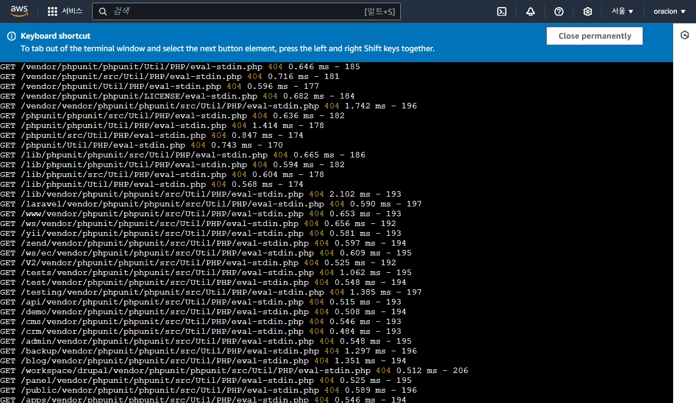

# 지난 10일 나의 목표는?!
- [x] 프로젝트 개발하기
- [x] 멤버십 열심히하기
- [ ] 개발 블로그 1편 이상 쓰기

# 일주일 회고
> 너무 쉬고 싶을 정도로 너무 바쁜 일주일이었던 것 같다.

## 프로젝트를 열심히했다. 🧨
- 원하는 진로는 프론트엔드에 더 가깝지만 하고 있는 백엔드 프로젝트를 하고 있다. 💣
- Express Nodejs 서버인데, Javascript에서 Typescript로 마이그레이션하는 것을 했다.
- 프론트엔드에서도 타입스크립트를 쓰지만 오류가 안나는 것과 무결성이 중요한 백엔드에서 더 중요하다고 생각했기 때문이다.
- 하면서 문제가 엄청 많았다.  
- 자바스크립트 문법으로 DB의 모델을 정의하고 조작하는 **ORM** 중 시퀄라이즈를 쓰고 있었는데
- 타입스크립트를 제대로 지원하지 않아서 버리고 **Prisma**라는 최신 ORM 라이브러리를 쓰기로 했다.
- 너무 편했다. 만약 시퀄라이즈와 프리즈마 둘 중 고민하는 분이 있다면 무 조 건 프리즈마를 추천하고 싶다.
- 처음으로 AWS를 써봤는데 **AWS의 EC2 인스턴스**를 만들고 거기에 기존에 만들어둔 도커 컨테이너를 올려서 배포했다.
- 신기했는데 **개발 환경이랑 프로덕션 환경이랑 차이가 많이 나서** 관련된 문제를 해결하는데 시간이 너무 많이걸려서 힘들었다.
- 한번 문제가 생기면 계속 생각나서 빨리 해결하고 싶어하는 성격이라 **밤새가면서 했던 것 같다.** 지금은 잘 된다.
- 백엔드는 확실히 코드 짜는 것은 쉽지만 환경설정하고 설계하는 부분이 어려운 것 같다고 느꼈다.

## 여담 💣
- 서버를 클라우드에 올렸는데 누군가 해킹시도를 한 로그가 찍혔다!!
- 처음 봤을땐 놀랐지만 내 서버를 뚫지 못한 로그를 보고 안심했다
- 하하

# 느낀 점
- 뭔가 정말 풀스택 개발자가 된 것 같은 기분이 들어서 좋았다.
- 마이그레이션 하느라 시간을 다 써서 개발블로그를 쓰지 못했다.
- 하지만 이번 문제를 해결하면서 겪은 것들을 써볼까 생각 중이다.

# 앞으로 10일 동안 나의 목표는?!
- [ ] 프로젝트 개발하기
- [ ] 멤버십 열심히하기
- [ ] 개발 블로그 1편 이상 쓰기
- [ ] 휴식하기