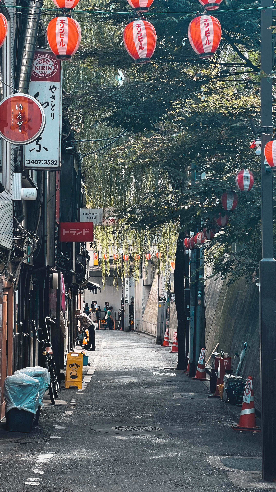
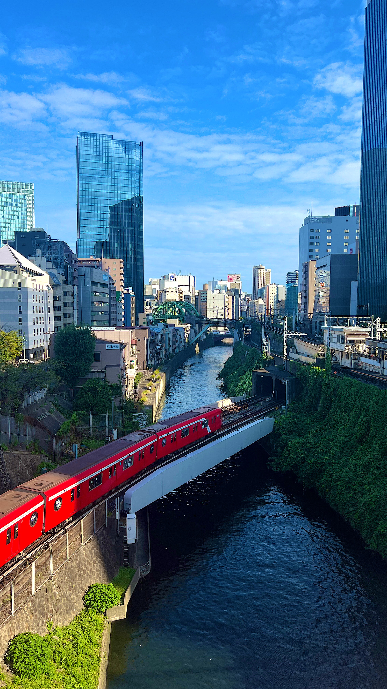

# 지난 10일 나의 목표는?!
- [x] 프로젝트 개발하기
- [ ] 개발 블로그 1편 이상 쓰기
- [x] 휴식하기

# 일주일 회고
> 일본 도쿄로 4박 5일 여행을 다녀왔다. 빡센 부캠 일정으로 인해 딱 쉬고 싶어진 시기에 다녀올 수 있어서 좋았던 것 같다.

## 도쿄 여행
사진 찍는걸 좋아하는데 이번에 원없이 찍은 것 같아서 너무 좋았다. 

먹기도 많이 먹었는데 먹은 만큼 걸어다녔다..

## 그룹 프로젝트
다음 주부터 부스트캠프에서 그룹 프로젝트를 시작한다. 힘든 일정이 될 것이라는 얘기를 들어서 조금은 걱정이 되지만 열심히 해야겠다는 생각을 했다. 👾

# 느낀 점
- 여행을 다녀와서 힐링을 할 수 있어서 좋았다.
- 개발 블로그를 쓰지 못했다.

# 앞으로 10일 동안 나의 목표는?!
- [ ] 그룹 프로젝트하기
- [ ] 개발 블로그 1편 이상 쓰기