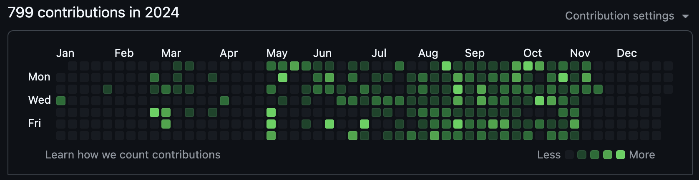

> 8월 달에 시작한 100일간의 GitHub 잔디 심기 챌린지가 11월 12일로 끝이 났다. 그 동안 작성한 회고와는 다른 방식으로 회고를 적어 봤다. 지난 100일을 돌아보며 어땠는지 나 자신에게 질문을 던지고 답하는 형식으로 회고를 해보았다.

# Q1. 이번 챌린지를 통해 무엇을 배웠고, 어떤 새로운 깨달음을 얻으셨나요?

꾸준히 한다는 것은 정말 어렵다는 걸 느꼈습니다. 특히, 주말이나 공휴일에도 하루도 빠짐없이 커밋을 올리고 인증하는 건 쉬운 일이 아니었어요. 하지만 누군가와 함께 공부를 한다는 점은 큰 동기부여가 되었다는 걸 깨달았습니다.

또한, 제가 직접 스터디를 운영했을 때는 타인의 스터디에 참여할 때보다 훨씬 더 열심히 임하게 되고, 더 많은 것을 배우게 되더라고요. 예를 들어, 사람들과 어떻게 소통해야 하는지, 공지 메일을 보낼 때 어떻게 보내는지와 같은 점에서 많은 깨달음을 얻었습니다.

하지만 시간 관리에는 큰 어려움을 느꼈습니다. 동시에 여러 스터디에 참여하고 프로젝트까지 진행하다 보니 우선순위가 높은 일에 집중하게 되고, 우선순위가 낮은 것들은 신경 쓰지 못하는 경우가 많았습니다. 이번 챌린지 스터디에서도 운영자로서 참여자였지만, 다른 부트캠프에 더 많은 시간을 할애하다 보니 챌린지에 적극적으로 임하지 못했던 점이 아쉬웠어요.

결국, 선택과 집중의 중요성을 다시 한번 깨닫게 되었습니다. 모든 것을 잘 해내려 하기보다는 가장 중요한 것에 집중하는 것이 더 효과적이다는 걸 느꼈습니다.

# Q2. 챌린지를 진행하면서 아쉬웠던 점이 있다면 무엇인가요?

오프라인으로 한 번도 모이지 못했다는 점이 가장 아쉬웠습니다. 처음에는 모각코(모여서 각자 코딩하기) 같은 활동을 해볼까 고민도 했지만, 결국 실행에 옮기지 못했어요. 챌린지가 끝난 후에는 커피챗 같은 이벤트를 기획하려 했지만, 개인적인 일로 여유가 없어 진행하지 못한 점도 아쉬움으로 남습니다.

참여자들과 회고를 통해서만 소통했던 것도 아쉬웠습니다. 챌린지 기획 당시에는 멘토 역할도 해보겠다고 적어 두었는데, 정작 제대로 해낸 게 없다고 느껴요. 멘토-멘티 활동은 거의 하지 못했고, 결과적으로 이 챌린지는 잔디 심기에만 집중된 챌린지가 되어버린 것 같아 조금 아쉽습니다😢

# Q3. 이번 챌린지를 잘 운영했다고 생각하시나요? 어떤 점에서 그렇게 느끼셨나요?

솔직히 말하면, 이번 챌린지를 잘 운영했다고 생각하지 않습니다. 혼자 운영하다 보니 공지 메일을 늦게 보낸다거나 먼저 다가가서 소통하는 데 미흡했던 부분이 많았어요. 챌린지 초반에는 디스코드에서 스몰토킹 주제를 던지며 활발히 소통하려고 했지만, 중간에 다른 부트캠프에 참여하면서 챌린지 운영에 소홀해졌다고 느꼈습니다. 그래도 착한 후배님들이 불평불만 없이 참여해 주셔서 정말 감사했습니다.

다음에 이런 챌린지를 운영하게 된다면, 처음부터 끝까지 꾸준히 적극적으로 참여할 수 있는 방안을 더 고민해볼 것 같아요. 예를 들어, 주기적으로 대면이나 비대면으로 모여서 1시간 정도 이야기를 나누는 시간을 정기적으로 가지는 것도 좋은 방법일 것 같습니다. 제가 참여했던 블로그 포스팅 스터디에서는 매주 일요일 저녁 8시에 모여 자신이 쓴 글을 공유하고 의견을 나누는 시간이 있었는데, 이런 방식이 강제성을 부여해 꾸준히 참여하도록 도와줬던 경험이 떠오릅니다. 이번 챌린지에서도 이런 요소를 도입했다면 더 좋았을 것 같아요.

# Q4. 챌린지를 통해 개인적으로 성장했다고 느끼는 부분이 있다면 무엇인가요?

이번 챌린지는 제가 두 번째로 스터디를 운영한 경험인데, 첫 번째 운영 때보다 기획부터 운영까지 더 성장했다고 느꼈습니다. 예를 들어, 회고 공지 메일을 보내는 방법이나 깃허브 리포지토리를 활용해 참가자들의 회고를 공유하는 방식은 첫 번째 스터디에서 느낀 아쉬움을 반영해 개선한 부분입니다. 물론 이번 스터디에도 대면 모임을 하지 못한 점처럼 아쉬움이 남지만, 첫 번째 스터디 운영보다는 확실히 발전했다고 생각합니다.

챌린지를 통해 2024년 동안 심어진 잔디를 보며 이전보다 꾸준히 공부해왔다는 성취감을 느낄 수 있었습니다.

회고를 통해 내가 잘한 점과 아쉬운 점을 스스로 파악하는 메타인지 능력이 향상됐다고 생각합니다. 10일 주기로 회고를 작성하면서 내가 잘한 점과 아쉬운 점을 스스로 분석하는 과정을 반복했습니다. 처음에는 1시간 이상 걸렸지만, 점차 익숙해져서 30분이면 작성할 수 있을 정도로 능숙해졌습니다. 이러한 반복 덕분에 스스로의 행동과 결과를 객관적으로 바라보는 능력이 향상됐다고 느꼈습니다.

또 한 가지 변화는 모르는 것에 대한 스트레스가 줄어든 것입니다. 이전에는 조금이라도 막히는 부분이 있으면 "왜 안 되지? 나는 왜 이걸 모를까?" 같은 부정적인 생각으로 스트레스를 많이 받았는데, 지금은 "모르면 어때? 알아가면 되지!"라는 긍정적인 사고를 할 수 있게 되었습니다. 이런 마음가짐의 변화는 앞으로도 큰 도움이 될 것 같아요.

# Q5. 10일마다 회고를 작성해달라고 요청하셨는데, 운영자님이 뒤로 갈수록 마감 기한을 어기신 이유는 무엇인가요? (가볍게 웃으며 답할 수 있도록 장난스러운 느낌으로 질문 드려요!)

이번 마지막 회고는 집안일도 있었고, 감기가 심하게 걸려서 작성할 정신이 없었습니다... 너무 늦어 죄송합니다! 😭

사실 챌린지 후반으로 갈수록 마감 기한을 지키지 못한 가장 큰 이유는 부트캠프 참여 때문이었어요. 프로젝트 캠프를 이수하고 바로 우테코 프리코스에 참여했는데 생각보다 난이도가 높더라고요! 😅 그래서 에너지를 그쪽에 쏟다 보니 스터디 회고 작성은 우선순위에서 밀렸습니다. 그래도 지금 이렇게 마지막 회고를 작성하며 반성하고 있습니다... 다음에는 더 철저하게 해볼게요!

# Q6. 다시 기회가 생긴다면, 이와 비슷한 챌린지를 또 운영할 계획이 있으신가요?

잔디 심기 챌린지는 성실함을 어필하기 위한 목적으로 시작했는데, 다음에 비슷한 챌린지를 한다면 좀 더 구체적인 주제를 다뤄보고 싶어요. 예를 들어, 개발자들이 필수적으로 알아야 하는 CS 지식에 대해 공부하고 서로 토론하는 시간을 가지는 스터디나, 특정 개발 서적을 정해놓고 함께 읽고 토론하는 시간을 갖는 것도 재미있을 것 같아요!

# Q7. 100일 동안 챌린지를 운영하고 참가하며 느낀 전반적인 소감은 무엇인가요?

개발자 관련 행사에 참여하면서 GitHub 잔디를 꾸준히 심는 것이 성실함을 나타낼 수 있다는 말을 듣고, GitHub 잔디 심는 것에 관심을 갖게 됐습니다. 그러다 GitHub 잔디 심기 챌린지를 떠올렸습니다. 처음에는 친구들과 하려고 했지만, 대학교 후배들이 떠오르더라고요. 연락을 했더니 흔쾌히 참가하겠다고 해줘서 정말 고마웠습니다. 덕분에 같이 열심히 공부할 수 있었어요.

대면으로 만나서 좀 더 얘기를 나누고 친해졌으면 했지만 그런 시간이 없어 아쉬웠습니다. 하지만...! GitHub 잔디 내역을 보면 상반기보다 후반기에 훨씬 더 빼곡히 채워져 있어 뿌듯합니다. 100일 동안 함께 참여해주신 모두에게 감사드리고, 정말 수고 많으셨습니다! 👏 

# Q8. 챌린지가 종료된 후에는 어떤 계획을 가지고 계신가요?

우테코 프리코스가 끝나 현재 결과를 기다리고 있는 중입니다. 만약을 대비해 우테코 코딩테스트 준비를 하고, 그동안 미뤄왔던 이력서를 다시 작성해서 서류를 넣을 계획입니다. 취업을 목표로 하고 있거든요! 9월에 실무 프로젝트를 하면서 '개발자로서 빨리 일을 시작하고 싶다'는 생각이 강해졌습니다. 사람들이 실제로 사용하는 서비스를 만들어내는 일이 정말 재밌더라고요. 그래서 더 열심히 준비하고 있습니다! 빠른 시일 내에 좋은 소식을 전하고 싶네요!
